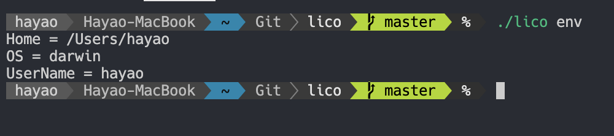

## lico.listの書き方


### 基本構文

パスは相対パスを用いるるか、以下のテンプレート構文を用いて絶対パスを指定してください。

「リポジトリ内のパス」はそのリポジトリのルートからの相対パスを指します。

「ホームディレクトリでのパス」はホームディレクトリからの相対パスを指します。

```txt
<リポジトリ内のパス>:<ホームディレクトリでのパス>
```

### オプション

**現在準備中**

### テンプレート構文

リストファイルではGolangのテンプレートを使用できます。テンプレートを用いてOSごとに分岐したり、絶対パスで指定することができます。

テンプレートで利用可能な変数の一覧は`env`コマンドで確認できます。



**例**

```txt
zsh/{{ .OS }}/zshrc:{{ .Home }}/.zshrc
```

上の例では、Linuxの場合は`zsh/linux/zshrc`、Macの場合は`zsh/darwin/zshrc`を`~/.zshrc`に配置します。

#### 関数

テンプレート内で利用可能な関数の一覧です

関数名 | 引数 | 返り値 | 説明
--- | --- | --- | ---
environ | string | string | 環境変数を参照
isset | string | bool | 変数がセットされているか
isempty | string | bool | 文字が空かどうか
is_installed | string | bool | コマンドがインストールされているか
isunix | | bool | OSがUnix系・Unix互換かどうか

### コメント

`#`で始まる行はコメントとして扱われます。

### カスタム変数

環境変数を用いてカスタム変数を定義することができます。

`LICO_`で始まる環境変数は自動的にカスタム変数として登録されます。

**例**

```bash
env LICO_CUSTOM_VAR=custom_value lico env
```

### コマンドで操作: 追加

`add`コマンドを用いてファイルをリストに追加することができます。

自動でテンプレート構文に変換するため、難しいことを考えずに追加することができます。

**実行した際のカレントディレクトリは関係ありません**

```bash
lico add <リポジトリ内のパス> <ホームディレクトリからの相対パス>
```


